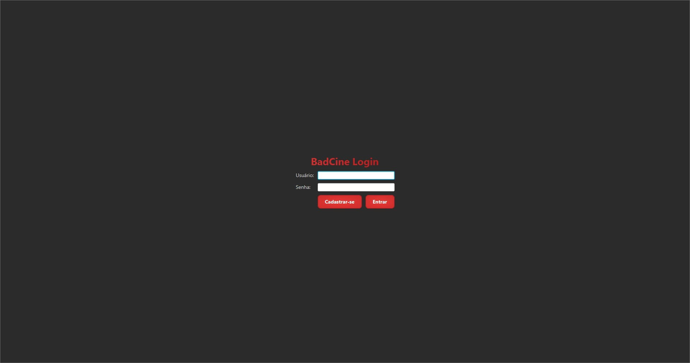
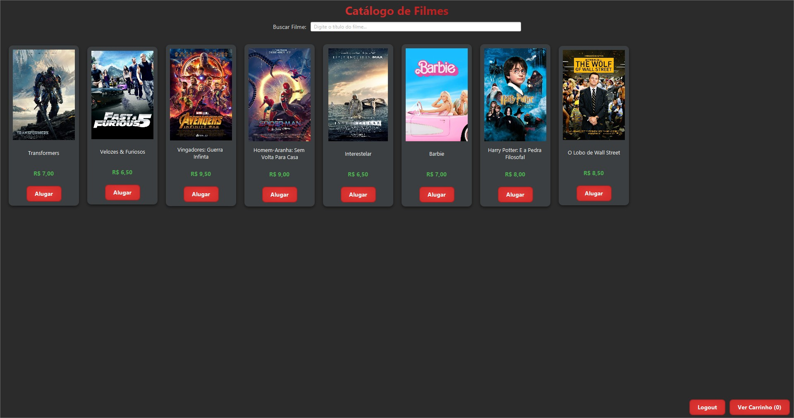
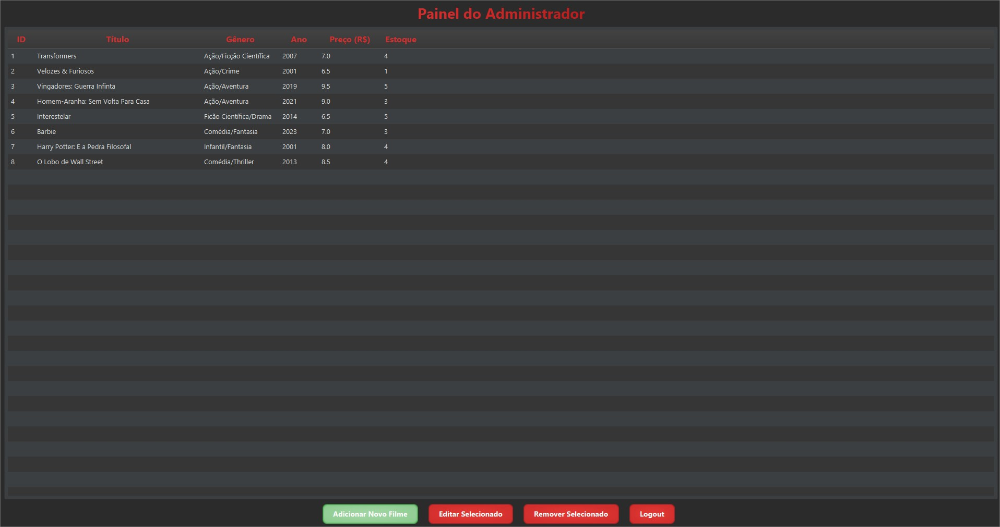

# 🎬 BadCine - Sistema de Locadora de Filmes

## 📄 Descrição do Projeto

**BadCine** é uma aplicação de desktop para gerenciamento de uma locadora de filmes, desenvolvida como projeto final para a disciplina de Programação Orientada a Objetos. O sistema permite a interação de dois tipos de usuários: clientes e administradores, cada um com suas respectivas funcionalidades, em uma interface gráfica moderna e intuitiva construída com JavaFX.

O projeto demonstra a aplicação prática de conceitos fundamentais de POO, como Herança, Polimorfismo, Encapsulamento e o uso de Padrões de Projeto como o DAO para a persistência de dados em arquivos CSV.

---

## ✨ Funcionalidades

### Para Clientes:
- **Cadastro e Login:** Novos usuários podem se cadastrar e usuários existentes podem se autenticar.
- **Catálogo Visual:** Navegação por um catálogo de filmes que exibe os pôsteres em uma grade dinâmica.
- **Busca em Tempo Real:** Filtra os filmes do catálogo conforme o usuário digita o título.
- **Carrinho de Compras:** Adiciona e remove filmes do carrinho antes de finalizar o aluguel.
- **Finalização de Aluguel:** Confirma o aluguel, atualizando o estoque de filmes de forma persistente.
- **Logout:** Encerra a sessão e retorna à tela de login.

### Para Administradores:
- **Autenticação Segura:** Login com credenciais de administrador.
- **Painel de Controle:** Acesso a uma dashboard para gerenciamento completo do sistema.
- **CRUD de Filmes:** Funcionalidade completa para **Criar, Ler, Atualizar e Excluir** filmes do catálogo, incluindo a seleção de imagens de pôster através de um seletor de arquivos.
- **Persistência Imediata:** Todas as alterações no catálogo são salvas automaticamente no arquivo `filmes.csv`.

---

## 🛠️ Tecnologias Utilizadas

- **Linguagem:** Java 17+
- **Interface Gráfica:** JavaFX com FXML
- **Build e Gerenciamento de Dependências:** Gradle
- **Estilização:** CSS
- **Persistência de Dados:** Arquivos de Texto (CSV)
- **IDE:** IntelliJ IDEA

---

## 📋 Pré-requisitos

Para executar este projeto, você precisará ter os seguintes softwares instalados em sua máquina:

- **JDK (Java Development Kit):** Versão 17 ou superior.
- **IntelliJ IDEA:** Versão Community ou Ultimate.

_O **JavaFX SDK não é mais necessário** ser baixado separadamente, pois o Gradle cuidará disso automaticamente._

---

## 🚀 Executando a Aplicação

A forma mais fácil de executar o projeto é usando o pacote de distribuição (`.jar`) fornecido.

1.  **Pré-requisito:** Certifique-se de ter o **Java (JRE ou JDK) versão 17 ou superior** instalado em sua máquina.

2.  **Baixe o Projeto:**
    - Vá para a seção **"Releases"** deste repositório no GitHub e baixe o arquivo `BadCine-Final.zip`.
    - Ou, clone o repositório e encontre o arquivo `BadCine-1.0.jar` na raiz.

3.  **Prepare o Ambiente (se não baixou o .zip):**
    - Crie uma pasta em seu computador.
    - Coloque o arquivo `BadCine-1.0.jar` dentro dela.
    - Copie as pastas `data` e `imagens` do repositório para dentro desta mesma pasta.

4.  **Execute via Linha de Comando:**
    - Abra um terminal (CMD, PowerShell, Git Bash, etc.) **dentro da pasta de entrega**.
    - Digite o seguinte comando e pressione Enter:
      ```bash
      java -jar BadCine-1.0.jar
      ```
    - A aplicação será iniciada.

---

## 🔑 Credenciais de Acesso

Você pode usar as seguintes credenciais para testar a aplicação:

- **Perfil de Administrador:**
    - **Login:** `admin`
    - **Senha:** `777`

- **Perfil de Cliente:**
    - **Login:** `mateus`
    - **Senha:** `123`

_Você também pode criar novos usuários através da tela de cadastro._

---

## 🖼️ Screenshots

**Tela de Login:**


**Catálogo de Filmes:**


**Painel do Administrador:**
